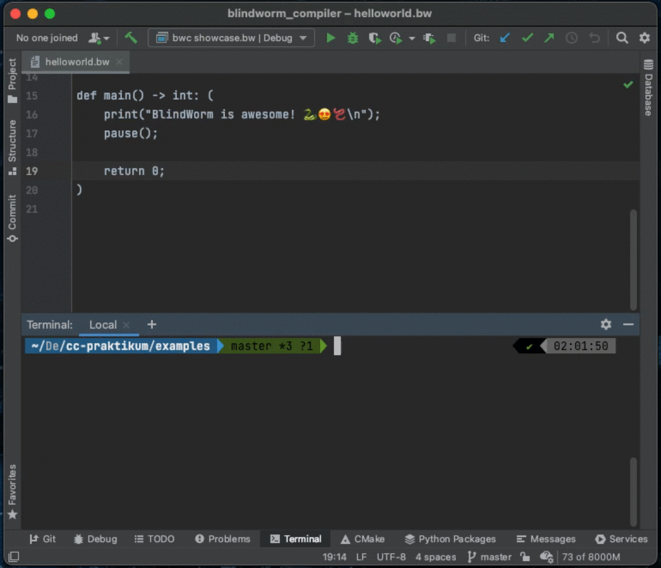

# Compiler Construction in Summer 2021
David Niklas Adamson\
Maximilian Erren



# Blindworm Compiler
This project contains a compiler written in C++, that transforms a Python like dialect called "Blindworm" into LLVM code.
## Getting started
### Cloning the repository
This project uses Google Test to run unit tests. Please clone this repository such as all the required git submodules.
```
git clone --recursive https://github.com/adamsondavid/blindworm.git
```
### Compiling the compiler
We are using cmake as buit tool. To compile the project just run the following commands.
```
cmake -S . -B cmake-build-debug
cmake --build cmake-build-debug
```
The binary executable will be named `blindworm_compiler` and is located in the `cmake-build-debug` folder.
## Tokens
| Token          | Regex                                               | Description                                                           |
|----------------|-----------------------------------------------------|-----------------------------------------------------------------------|
| NATIVE         | `native`                                            | Beginning of a native function definition                             |
| DEF            | `def`                                               | Beginning of a function definition                                    |
| ARROW          | `->`                                                | Indicator between the parameter list and the returntype of a function |
| RETURN         | `return`                                            |                                                                       |
| IF             | `if`                                                |                                                                       |
| ELSE           | `else`                                              |                                                                       |
| ELIF           | `elif`                                              |                                                                       |
| WHILE          | `while`                                             |                                                                       |
| COLON          | `:`                                                 |                                                                       |
| COMMA          | `,`                                                 |                                                                       |
| SEMICOLON      | `;`                                                 | Marks the end of a statement.                                         |
| LPAREN         | `(`                                                 |                                                                       |
| RPAREN         | `)`                                                 |                                                                       |
| PLUS           | `+`                                                 | Arithmetic Plus Operator                                              |
| MINUS          | `-`                                                 | Arithmetic Minus Operator                                             |
| MUL            | `*`                                                 | Arithmetic Multiplication Operator                                    |
| DIV            | `/`                                                 | Arithmetic Division Operator                                          |
| NOT_EQUALS     | `!=`                                                | Boolean Not Equals Operator                                           |
| EQUALS         | `==`                                                | Boolean Equals Operator                                               |
| GREATER_THAN   | `>`                                                 | Boolean Greater Than Operator                                         |
| GREATER_EQUALS | `>=`                                                | Boolean Greater Equals Operator                                       |
| LESS_THAN      | `<`                                                 | Boolean Less Than Operator                                            |
| LESS_EQUALS    | `<=`                                                | Boolean Less Equals Operator                                          |
| AND            | `and`                                               | Boolean And Operator                                                  |
| OR             | `or`                                                | Boolean Or Operator                                                   |
| NOT            | `not`                                               | Boolean Negating Operator                                             |
| NONE           | `None`                                              | Placeholder for nothing                                               |
| BOOL           | `bool`                                              |                                                                       |
| INT            | `int`                                               |                                                                       |
| FLOAT          | `float`                                             |                                                                       |
| STR            | `str`                                               |                                                                       |
| INT_LITERAL    | `[0-9]+`                                            | No scientific notation for now                                        |
| FLOAT_LITERAL  | `([0-9]*[\.])?[0-9]+`                               | No scientific notation for now                                        |
| STR_LITERAL    | <code>(\\"(.\*?)\\")&#124;('(.\*?)')</code>         |                                                                       |
| BOOL_LITERAL   | <code>True&#124;False&#124;Yes&#124;No</code>       |                                                                       |
| IDENTIFIER     | `[a-zA-z_][a-zA-Z0-9_]*`                            | Variable or Function Name                                             |
| ASSIGN         | `=`                                                 | Assign a variable                                                     |
| UNKNOWN        | `.`                                                 | Any word that is not part of the language                             |
| END_OF_FILE    | `<<EOF>>`                                           |                                                                       |

## Grammar
```
program: statements END_OF_FILE

statements:
    | statement statements
    | ε
    
statement:
    | function_definition
    | native_function_definition
    | variable_assignment_OR_variable_declaration_OR_function_call
    | return_statement
    | while_statement
    | if_statement
    | ε
    
literal:
    | BOOL_LITERAL
    | INT_LITERAL
    | FLOAT_LITERAL
    | STR_LITERAL

returntype:
    | datatype
    | NONE

datatype:
    | BOOL
    | INT
    | FLOAT
    | STR
    
formal_parameters:
    | formal_parameter COMMA formal_parameters
    | formal_parameter
    | ε
    
formal_parameter:
    | IDENTIFIER COLON datatype
    | IDENTIFIER COLON datatype ASSIGN literal
    | ε

call_parameters:
    | expression
    | expression COMMA call_parameters
    | ε

expression:
    | or_expression

or_expression:    
    | and_expression OR or_expression
    | and_expression

and_expression:    
    | not_expression AND and_expression
    | not_expression

not_expression:    
    | NOT not_expression
    | comparison_expression

comparison_expression:
    | arithmetic_expression NOT_EQUALS comparison_expression
    | arithmetic_expression EQUALS comparison_expression
    | arithmetic_expression GREATER_THAN comparison_expression
    | arithmetic_expression GREATER_EQUALS comparison_expression
    | arithmetic_expression LESS_THAN comparison_expression
    | arithmetic_expression LESS_EQUALS comparison_expression
    | arithmetic_expression

arithmetic_expression:
    | term PLUS arithmetic_expression
    | term MINUS arithmetic_expression
    | term
    
term:
    | factor MUL term
    | factor DIV term
    | factor

factor:
    | MINUS atom
    | atom

atom:
    | literal
    | IDENTIFIER
    | IDENTIFIER function_call
    | LPAREN expression RPAREN

function_definition: DEF IDENTIFIER LPAREN formal_parameters RPAREN ARROW returntype COLON LPAREN statements RPAREN
    
native_function_definition: NATIVE DEF IDENTIFIER LPAREN formal_parameters RPAREN ARROW returntype SEMICOLON

variable_assignment_OR_variable_declaration_OR_function_call:
    | IDENTIFIER variable_assignment
    | IDENTIFIER variable_declaration
    | IDENTIFIER function_call SEMICOLON

variable_assignment: ASSIGN expression SEMICOLON

variable_declaration:
    | COLON datatype ASSIGN expression SEMICOLON
    | COLON datatype SEMICOLON
    
function_call: LPAREN call_parameters RPAREN

return_statement: 
    | RETURN SEMICOLON
    | RETURN expression SEMICOLON

while_statement: WHILE LPAREN expression RPAREN COLON LPAREN statements RPAREN

if_statement: IF LPAREN expression RPAREN COLON LPAREN statements RPAREN elif_statements else_statement
    
elif_statements:
    | elif_statement elif_statements
    | ε
    
elif_statement:
    | ELIF LPAREN expression RPAREN COLON LPAREN statements RPAREN
    | ε

else_statement:
    | ELSE COLON LPAREN statements RPAREN
    | ε
```
